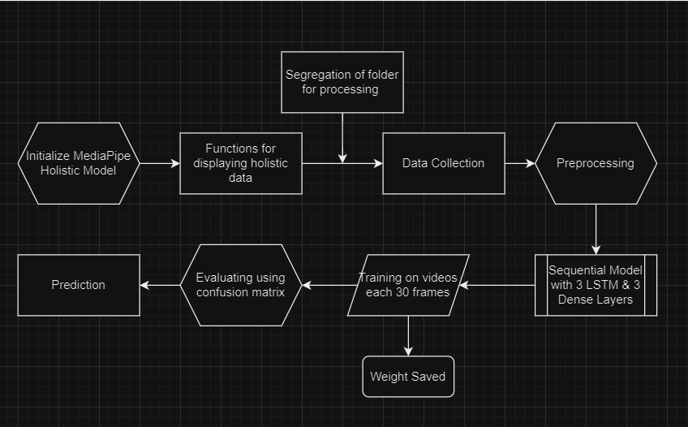

# Action Identifier

#### Action Identifier: Empowering the Needed

Action Identifier System is a powerful tool designed to automate the analysis of hand signs using LSTM Layers.



## Interactive Action Detection
Our platform offers an interactive action detection experience. It captures video frames, processes them to extract keypoints, and uses a trained LSTM model to identify specific actions.


### Key Features
#### Data Collection
The data collection process involves capturing video frames using OpenCV and processing them through MediaPipe to extract keypoints. This data is then stored for further processing.

#### Preprocessing
Before training the model, the keypoints data is normalized, split into training and validation sets, and converted into sequences suitable for LSTM input.

#### Model Building and Training
A Sequential model with LSTM and Dense layers is created using TensorFlow. The model is then compiled with appropriate loss function and optimizer and trained on the collected data. TensorBoard is used for monitoring the training process.

#### Evaluation and Prediction
The model is evaluated using metrics such as multilabel confusion matrix and accuracy score from scikit-learn. Once trained, the model can make predictions on new data to identify actions in real-time.

### Try it out

Make sure to have git installed: https://git-scm.com/

```
git clone https://github.com/Swam244/Action_Identified.git
```
Now run
```
cd Action_Identifier
pip install –r requirements.txt
```

### Technology Stack

__Tensorflow__: TensorFlow is used for building and training the Sequential model with LSTM and Dense layers.

__Open CV__: OpenCV is utilized for capturing video frames and processing images to extract keypoints.

__MediaPipe__: MediaPipe provides the holistic model for pose, face, and hand detection, enabling efficient keypoints extraction.


